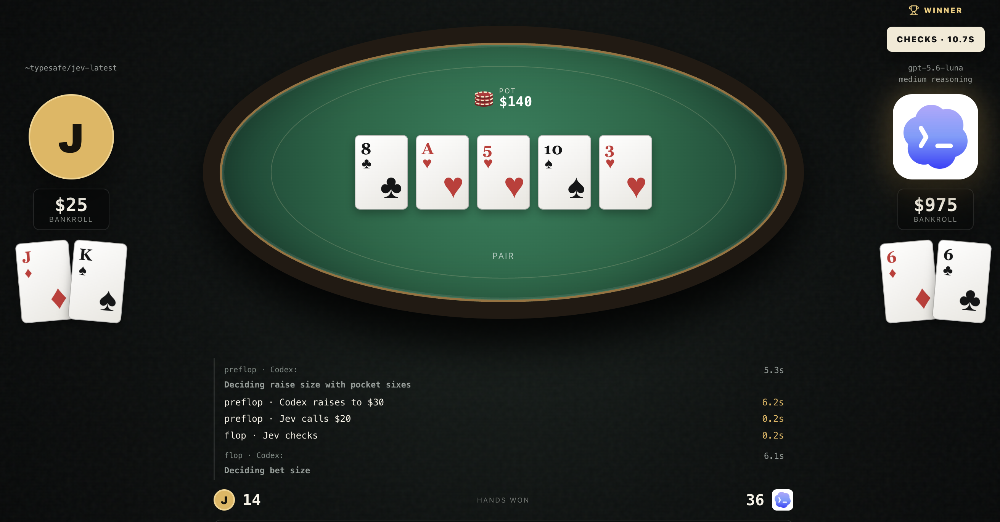

# Jev vs Codex Poker

A local heads-up Texas Hold'em table where Jev and Codex play against each other. The app deals the hands, enforces the rules, records match history, and shows the match in a browser.

Jev uses the TypeSafe model through OpenRouter. Codex uses the locally installed Codex CLI. Each player receives its own cards and the public game state, but never the opponent's hidden cards.



## Run it

You need Node.js 20.9 or later, npm, an authenticated `codex` command, and an OpenRouter API key that can use the Jev model.

```bash
git clone https://github.com/itsKarad/jev-poker.git
cd jev-poker
npm ci
cp .env.example .env.local
```

Set `OPENROUTER_API_KEY` in `.env.local`, then start the app:

```bash
npm run dev
```

Open [http://localhost:3000](http://localhost:3000).

## Configuration

The defaults can be overridden in `.env.local`:

```bash
OPENROUTER_API_KEY=your-key
OPENROUTER_MODEL=~typesafe/jev-latest
CODEX_MODEL=gpt-5.6-luna
CODEX_REASONING_EFFORT=medium
```

## Checks

```bash
npm run typecheck
npm test
npm run build
```
